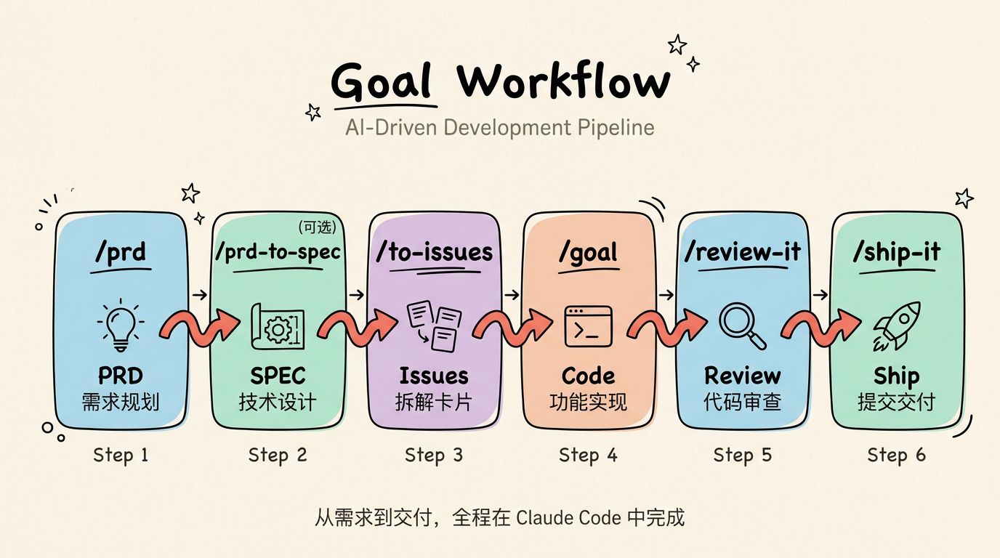

# goal-workflow

[English](./README.md) | 简体中文

一套 AI 驱动的研发工作流，从需求到代码交付，全程在 Claude Code 中完成。

```
/prd  →  /goal  →  /review-it  →  /ship-it
```

<p align="center">
  
</p>

## 安装

```bash
npx skills add smallnest/goal-workflow
```

## 技能列表

| 命令 | 说明 |
|------|------|
| `/prd` | 生成 PRD 并拆解为 Issue |
| `/goal` | 端到端实现 Issue（Claude Code 内置） |
| `/review-it` | 自动化代码审查与迭代修复 |
| `/ship-it` | 提交、PR、合入、关闭 Issue |
| `/note-it` | 为 Issue 记录实现笔记 |
| `/humanize-it` | 文档去 AI 味改写 |
| `/listenhub-tts` | ListenHub 文本转语音 |
| `/insight-diagram` | UML 与架构图生成 |
| `/refactor` | 专家级代码重构（Fowler 目录） |
| `/modern-go` | Go 代码现代化改造（35+ 条规则） |

## 文档

完整使用指南：[docs/index.html](docs/index.html)

## 许可证

MIT